# Montage Maker

***An ImageMagick Companion by Ed Johnson***

v1.0.0

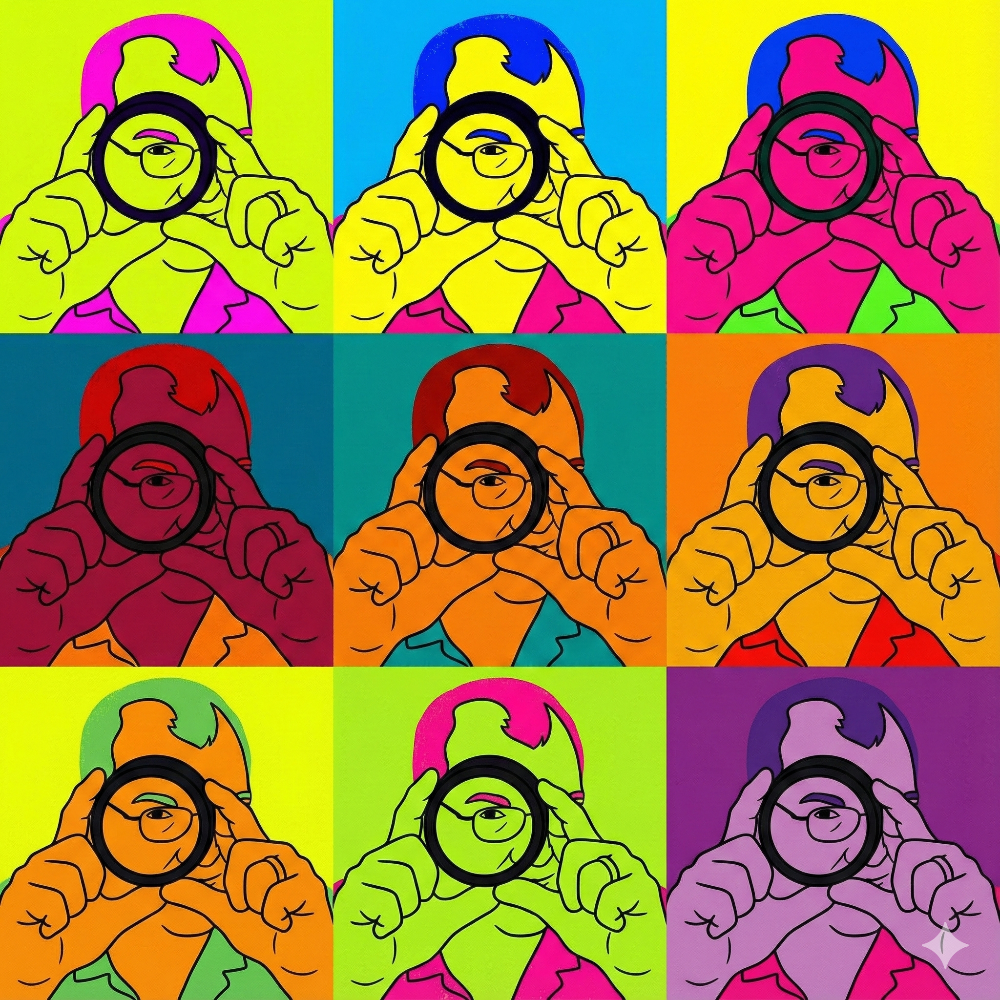

---

## User Guide

Montage Maker takes a folder full of images and turns it into a polished grid, contact sheet, social post, documentation image, or artful montage. It is useful for AI image batches, design variations, project photos, product mockups, reference sheets, and any visual collection that deserves to look organized instead of scattered.

You choose the grid size, tile dimensions, spacing, output format, text options, and visual effects. Montage Maker handles the assembly work using ImageMagick under the hood, then saves the result as one or more finished image files.

---

## Table of Contents

- [What Is Montage Maker?](#what-is-montage-maker)  
- [Quick Start (TL;DR)](#quick-start-tldr)  
- [Installation Options](#installation-options)  
  - [Recommended: Use the Standalone App](#recommended-use-the-standalone-app)  
  - [Required: Install ImageMagick](#required-install-imagemagick)  
  - [Optional: Run from Python Source](#optional-run-from-python-source)  
  - [Optional: Build Your Own Executable](#optional-build-your-own-executable)  
- [Running the App](#running-the-app)  
- [The Interface at a Glance](#the-interface-at-a-glance)  
- [Settings Walkthrough](#settings-walkthrough)  
  - [Grid](#grid)  
  - [Tile Size & Spacing](#tile-size--spacing)  
  - [Background](#background)  
  - [Output](#output)  
  - [Output Filename Prefix](#output-filename-prefix)  
  - [Text (Titles & Labels)](#text-titles--labels)  
  - [Effects](#effects)  
- [Selecting Which Images to Include](#selecting-which-images-to-include)  
- [Presets — Your Best Friends](#presets--your-best-friends)  
- [Preset Gallery — Examples & Image Direction](#preset-gallery--examples--image-direction)  
- [The Preset Manager](#the-preset-manager)  
- [File Conflict Dialog](#file-conflict-dialog)  
- [Using the CLI](#using-the-cli)  
- [Troubleshooting](#troubleshooting)

---

## What Is Montage Maker?

Montage Maker is a desktop tool for turning a folder of images into a clean, shareable montage. Point it at an image folder, choose a preset or customize the layout, and generate one or more finished output files.

It's great for:

- Creating contact sheets of AI image sets, design studies, or photo batches  
- Building social-ready posts for Instagram, Pinterest, X/Bluesky, YouTube thumbnails, and link previews  
- Comparing variations side by side so you can quickly spot your favorites  
- Generating documentation images for 3D printing, laser projects, CAD workflows, tutorials, and product examples  
- Making quick overview sheets of any image collection

**[SCREENSHOT: The Montage Maker main window]** (Screenshot 1)

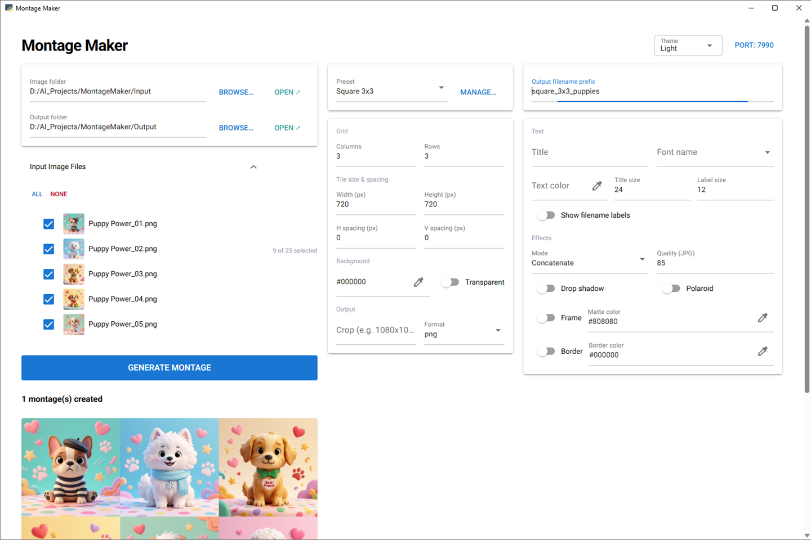

---

## Quick Start (TL;DR)

If you want to just jump in, here's the five-second version:

1. After installation (see instructions below), launch the app:  
   - **Windows standalone:** double-click `Montage_Maker.exe`  
   - **macOS standalone:** double-click `Montage_Maker`  
   - **Python/source version:** run `venv_win\Scripts\python app.py` on Windows or `venv_mac/bin/python app.py` on macOS/Linux  
2. In the **Left column**, click **Browse…** next to **Image folder** and pick your image folder.  
3. Set your **Output folder** the same way, or leave it blank and Montage Maker will create/use a `Montages` folder inside your image folder.  
4. In the **Middle column**, pick a **Preset** from the dropdown. Try **Square 3×3** to start.  
5. Expand **Input Image Files** if you want to choose exactly which images are included.  
6. Hit **Generate Montage**.  
7. Your montage file(s) appear in the output folder, and a preview with an “X montage(s) created” count appears below the button.

That's it. Everything else in this guide is about fine-tuning.

---

## Installation Options

There are two practical ways to use Montage Maker:

1. **Standalone app — easiest for most users.** Use the provided `Montage_Maker.exe` on Windows or `Montage_Maker` on macOS. You do not need to install Python for this option.  
2. **Python/source version — best for tinkerers, contributors, and anyone who wants to modify the code.** Use `setup.py` once, then run `app.py` from the virtual environment.

Either way, Montage Maker still needs **ImageMagick** installed and available on your system PATH, because ImageMagick does the actual montage-building work.

### **Recommended: Use the Standalone App**

This is the easiest path for most users.

**Windows**

1. Install ImageMagick using the instructions below.  
2. Put `Montage_Maker.exe` in a folder where you have permission to run apps.  
3. Double-click `Montage_Maker.exe`.  
4. If Windows asks for permission to run the app, approve it if you trust the source.

**macOS**

1. Install ImageMagick using the instructions below.  
2. Put `Montage_Maker` somewhere convenient, such as your Applications folder or a project folder.  
3. Double-click `Montage_Maker`.  
4. If macOS blocks the app because it came from outside the App Store, use the normal macOS security workflow to allow it.

**Note:** The standalone app includes the Python application code, but it does **not** replace ImageMagick. ImageMagick still has to be installed separately and available on PATH.

### 

### **Required: Install ImageMagick**

Montage Maker uses **ImageMagick** to do the heavy lifting. Install it before running the app.

**Windows 10 / 11**

1. Download the installer from [imagemagick.org](https://imagemagick.org/script/download.php#windows) — choose the 64-bit DLL build.  
2. Run the installer.  
3. Check **“Add application directory to your system path.”** This step matters.  
4. Open a new terminal and type:

*montage \-version*

You should see a version number.

**macOS**

```bash
brew install imagemagick
montage -version
```

**Linux (Ubuntu / Debian)**

```bash
sudo apt update && sudo apt install imagemagick
montage -version
```

### **Optional: Run from Python Source**

Use this route if you want to run the source code directly, customize the app, or contribute changes.

Run the bootstrap script once with your system Python. It creates a virtual environment and installs **Python dependencies.**

***\# Windows***  
python setup.py

***\# macOS / Linux***  
python3 setup.py

**After setup completes, launch the app with:**

***\# Windows***  
venv\_win\\Scripts\\python app.py

***\# macOS / Linux***  
venv\_mac/bin/python app.py

### **Optional: Build Your Own Executable**

Most users do not need this. If you are distributing Montage Maker or want to package your own standalone build, use the build instructions in `readme.md`.

The short version is:

***\# Windows***  
venv\_win\\Scripts\\python build.py

***\# macOS***  
venv\_mac/bin/python build.py

The build process creates `dist/Montage_Maker.exe` on Windows or `dist/Montage_Maker` on macOS. The executable still requires ImageMagick on PATH.

---

## Running the App

### **Standalone app**

**Windows:** double-click Montage\_Maker.exe

**macOS:**   double-click Montage\_Maker

A native desktop window opens — no browser required.

### **Python/source version**

***\# Windows***  
venv\_win\\Scripts\\python app.py

***\# macOS / Linux***  
venv\_mac/bin/python app.py

### **CLI (for command-line fans)**

The original command-line engine is still fully functional if you prefer that workflow. See [Using the CLI](#using-the-cli) at the end of this guide.

---

## The Interface at a Glance

The app uses a three-column layout:

| Column | What's in it |
| :---- | :---- |
| **Left (\~40%)** | Image folder, Output folder, **Input Image Files** selection panel, **Generate Montage** button, and output previews |
| **Middle (\~25%)** | Preset selector, Grid, Tile size & spacing, Background, Output format |
| **Right (\~35%)** | Output filename prefix, Text (title, font, colors, sizes, labels), Effects |

**[SCREENSHOT: Annotated version of screenshot_main_window.png with callouts for each column]** (Screenshot 2)

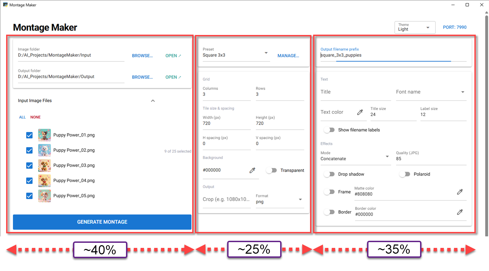

**The header** has two controls in the top-right corner:

| Control | What it does |
| :---- | :---- |
| **Theme** dropdown | Switch between four themes: **Light** and **Warm** (light modes) or **Dark** and **Midnight** (dark modes). Your choice is saved automatically and restored on next launch. |
| **Port: 8000** button | Change the server port if another app is using 8000\. Takes effect after restarting the app. |

---

## Settings Walkthrough

### **Grid**

Controls how many tiles appear on each page.

| Field | What it does |
| :---- | :---- |
| **Columns** | Number of tiles per row |
| **Rows** | Number of rows per page |

If your image folder has more images than fit on one page, Montage Maker automatically creates additional pages — `prefix_01.png`, `prefix_02.png`, and so on.

**Example:** A 3×3 grid with 12 images produces two pages — the first with 9 images, the second with 3\.

**[EXAMPLE OUTPUT: 3×3 grid of puppy images — 9 per page]** (Screenshot 3)


---

### **Tile Size & Spacing**

Controls how big each individual tile is and how much breathing room sits between them.

| Field | Format | What it does |
| :---- | :---- | :---- |
| **Width / Height** | pixels | The dimensions of each tile |
| **H spacing / V spacing** | pixels | The gap between tiles (horizontal and vertical) |

**Tip:** Larger spacing gives your montage an airy, editorial feel. Setting both H and V spacing to `0` (as shown in the Square 3×3 preset) makes tiles sit flush against each other — clean and compact. The **Concatenate** mode under Effects does the same thing automatically.

**[EXAMPLE OUTPUT: Same 3×3 grid — left with 10px spacing, right with 0px spacing / Concatenate]** (Screenshot 4)

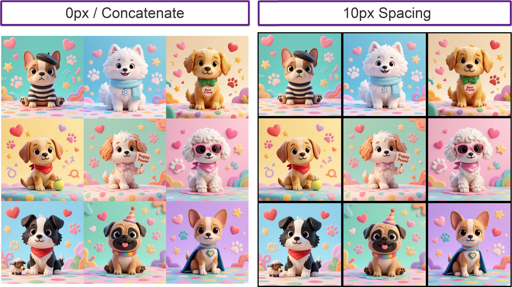

---

### **Background**

| Field | What it does |
| :---- | :---- |
| **Color** | The fill color that shows between and behind tiles. Accepts hex values (`#ffffff`) or named colors (`black`, `white`, `gray`, etc.) |
| **Transparent** | Removes the background entirely. Output format is automatically forced to PNG when this is on, since JPG doesn't support transparency. |

**[EXAMPLE OUTPUT: White background vs. black background vs. transparent (checkerboard)]** (Screenshot 5)


---

### **Output**

| Field | What it does |
| :---- | :---- |
| **Crop** | Center-crops each source image to the specified size before tiling (e.g. `1080x1080`). Great for making sure all tiles are the same proportions. |
| **Format** | The file format for output files: `png`, `jpg`, `bmp`, or `tiff`. |

**Tip:** Use **Crop** when your source images have mixed aspect ratios and you want a clean, uniform grid. Without it, ImageMagick will try to fit each image into the tile space as-is, which can result in letterboxing.

---

### **Output Filename Prefix**

The base name for your generated files. Pages are numbered automatically.

**Example:** A prefix of `puppies` with a 3×3 grid across two pages produces `puppies_01.png` and `puppies_02.png`.

---

### **Text (Titles & Labels)**

| Field | What it does |
| :---- | :---- |
| **Title** | A text banner printed above the entire montage |
| **Font name** | Font for all text — type to filter from a searchable list of installed fonts |
| **Text color** | Fill color for both the title and filename labels. Default is black — change this when your background is dark. |
| **Title size** | Point size for the title banner (independent of the label size) |
| **Label size** | Point size for filename labels |
| **Show filename labels** | Adds the source filename below each tile — great for contact sheets and documentation |

**Tip:** Title size and label size are fully independent — you can have a large, bold title at 48pt while keeping compact 10pt labels below each image.

**Tip:** The **Contact Sheet** preset has labels on by default — it's a handy reference for what labeled output looks like.

**[EXAMPLE OUTPUT: Contact sheet with filename labels under each tile]** (Screenshot 6)

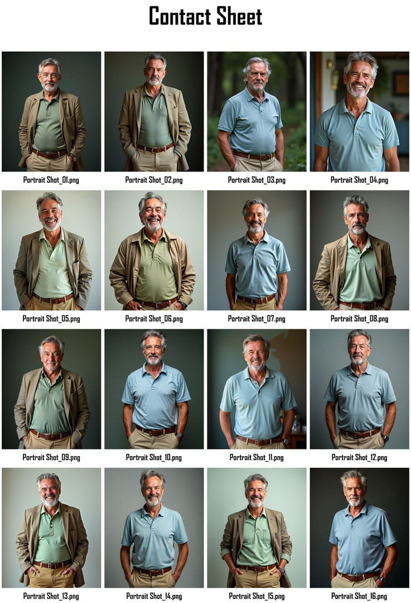

---

### **Effects**

This is where things get fun.

| Control | What it does |
| :---- | :---- |
| **Mode** | `Frame` — adds a decorative 3D border around tiles. `Concatenate` — zero spacing, tiles touch edge-to-edge. |
| **Quality (JPG)** | JPEG compression quality, 0–100. Default is 85\. Has no effect on PNG output. |
| **Drop shadow** | Adds a subtle shadow behind each tile. Automatically disabled while Polaroid is active — Polaroid already bakes in its own shadow. |
| **Polaroid** | Applies a Polaroid-style effect. Set a fixed angle, or enable **Random (±15°)** for a casually tossed look. |
| **Frame** | A beveled ornamental border around each tile. Controls: Width, Height, Outer bevel, Inner bevel, and **Matte color** for the frame color. Pairs naturally with Mode \= Frame. |
| **Border** | A flat solid border around each tile. Controls: Width, Height, and **Border color**. |

**[EXAMPLE OUTPUT: Drop shadow effect on a 2×2 grid]** (Screenshot 7)

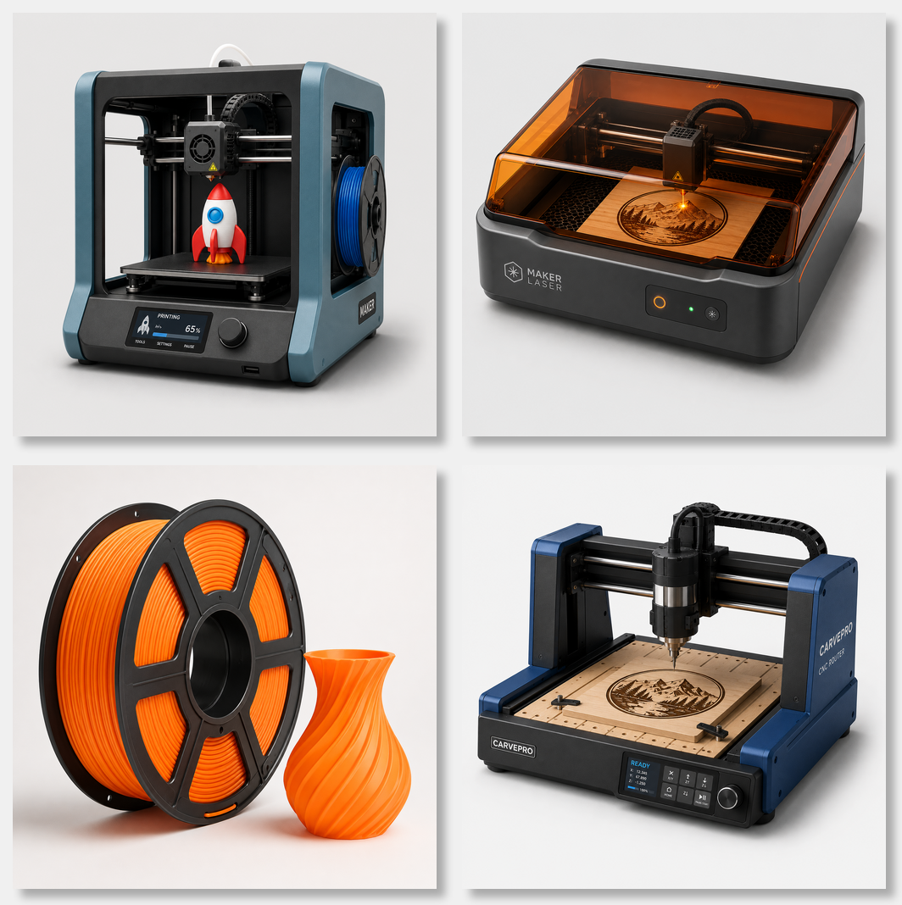

**[EXAMPLE OUTPUT: Polaroid effect with Random angle enabled]** (Screenshot 8)

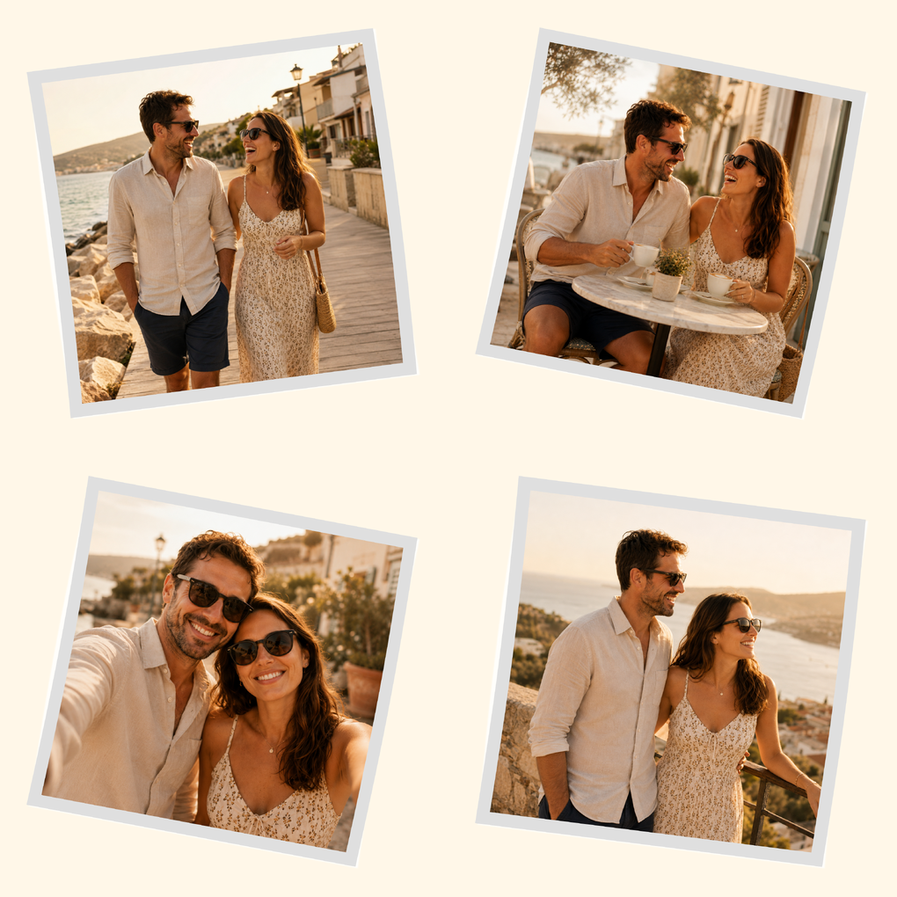

**[EXAMPLE OUTPUT: Frame effect with gray matte color]** (Screenshot 9)

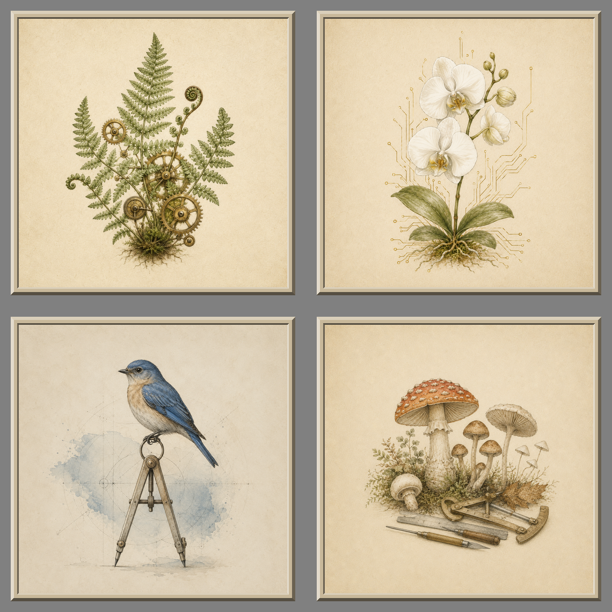

**Tip:** Drop shadow and Polaroid look especially nice together for a "scattered photos" aesthetic.

---

## Selecting Which Images to Include

Just above the **Generate Montage** button is a collapsible **Input Image Files** panel. Expand it to see every image in your input folder, each with a small thumbnail preview and a checkbox.

- Check the images you want included — unchecked images are skipped entirely.  
- Use **All** / **None** to select or deselect everything at once.  
- The count in the header (e.g. "7 of 12 selected") stays visible even when the panel is collapsed, so you always know your current selection at a glance.  
- The list refreshes automatically when you change the input folder.

**Tip:** This is much faster than moving files in and out of the folder when you want to experiment with different subsets of your images.

---

## Presets — Your Best Friends

Presets are saved collections of all your settings. Instead of dialing in 15 different fields, you just pick a preset from the dropdown and you're ready to go. Montage Maker ships with eleven presets built in:

| Preset | Grid | Description |
| :---- | :---- | :---- |
| **Contact Sheet** | 4×4 | 300px tiles with filename labels, cropped square — classic proof sheet |
| **Filmstrip** | 4×1 | 480px tiles, Concatenate mode, black background, proportional black borders — looks like a real film strip |
| **Gallery Wall** | 2×2 | 500px tiles, beveled frame, drop shadow, warm linen background — framed prints on a wall |
| **Instagram Post** | 2×2 | Cropped to 1080×1080, JPG — ready to upload |
| **Instagram Story** | 1×1 | Cropped to 1080×1920, JPG — full-screen story / TikTok format |
| **Link Preview** | 2×2 | Cropped to 1200×630, JPG — the universal OG image format for Discord, Slack, and social link shares |
| **Pinterest Pin** | 2×3 | Cropped to 1000×1500, JPG — tall Pinterest format |
| **Polaroid** | 3×2 | 450px tiles, Polaroid effect with random angles, dark background and drop shadow |
| **Square 3×3** | 3×3 | 720px tiles, PNG — a versatile general-purpose layout |
| **X Post** | 2×2 | Cropped to 1200×675, JPG — X / Bluesky ready |
| **YouTube Thumb** | 2×2 | Cropped to 1280×720 — YouTube thumbnail dimensions |

**Tip:** The social media presets (Instagram, Pinterest, X Post, Link Preview, YouTube Thumb) all have crop values set to their platform's ideal dimensions. This means your output is genuinely ready to upload — no resizing needed.

For example output and image-selection guidance for each preset, see [Preset Gallery](#preset-gallery--examples--image-direction) below.

---

## Preset Gallery — Examples & Image Direction

Each built-in preset is tuned for a specific type of content. This section shows an example output for each preset and gives you guidance on what kinds of images to use to get the best results.

---

### Contact Sheet

A classic proof sheet — designed to give you a scannable overview of many images at once. The filename labels are the defining feature.

**Best images for this preset:**

- AI image batches, photo shoot selects, or design iteration sets — 16 images from the same session
- Use **meaningful filenames** on your source images (e.g., `pose_01_smiling.png`) — the labels are the whole point
- Consistent style or subject across all 16 tiles makes the sheet readable at a glance
- Avoid wildly mixed content — this is a reference tool, not a mood board

**[EXAMPLE OUTPUT: Contact Sheet 4×4 with filename labels]**


---

### Filmstrip

A four-image horizontal strip on a black background — cinematic and sequential.

**Best images for this preset:**

- Sequential content: **before/after**, process steps, storyboard frames, or a travel narrative
- 4 images that tell a story read left-to-right
- Landscape-oriented images work better than portraits in the narrow horizontal strip
- Dramatic or cinematic lighting plays into the film-strip aesthetic

**[EXAMPLE OUTPUT: Filmstrip 4×1 — sequential scenes on black]**


---

### Gallery Wall

Four framed prints on a warm linen background — ideal for art and fine photography.

**Best images for this preset:**

- Fine art prints, framed photography, botanical illustrations, or architectural shots
- Warm tones and clean compositions complement the linen background
- Let your images breathe — avoid busy or noisy subjects; the beveled frame draws focus
- Subjects with clear foregrounds and natural margins look best inside the frame

**[EXAMPLE OUTPUT: Gallery Wall 2×2 — framed prints on linen]**


---

### Instagram Post

A 2×2 grid cropped to 1080×1080 — ready to upload as a multi-image Instagram post.

**Best images for this preset:**

- Product reveals, mood boards, portfolio highlights, or food photography
- All 4 images should share a **color palette or visual theme** — they'll be seen side by side in the feed
- Strong contrast and saturation read well on mobile; avoid muted or low-contrast images
- Square-friendly subjects that survive center-cropping (avoid key content at the very top or bottom)

**[EXAMPLE OUTPUT: Instagram Post 2×2 — 1080×1080 crop]**


---

### Instagram Story

A single full-screen image cropped to 1080×1920 — one story frame per output file.

**Best images for this preset:**

- This preset outputs **one image per run** — it's not a grid, it's a full-bleed vertical crop
- Bold portrait-oriented subjects that fill a phone screen: full-length product shots, architectural verticals, or striking portraits
- The 9:16 crop is very tall — subjects that extend top-to-bottom use the space best
- Works well for text-on-image designs with plenty of vertical breathing room

**[EXAMPLE OUTPUT: Instagram Story — 1080×1920 vertical]**

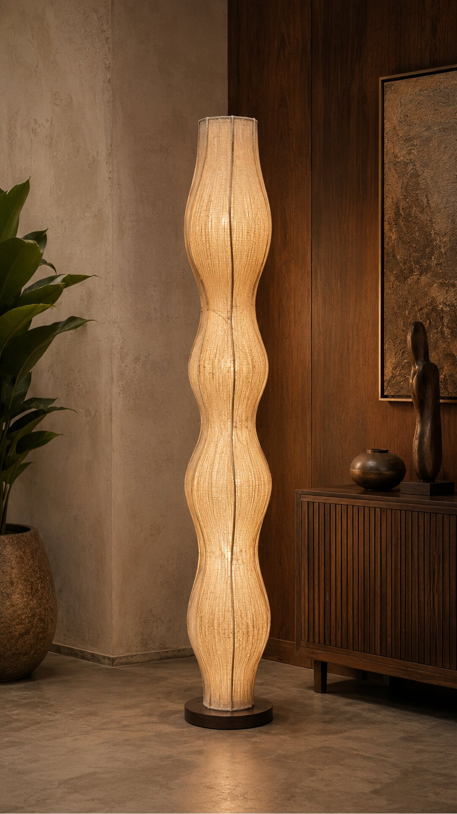

---

### Link Preview

A 2×2 grid cropped to 1200×630 — the universal OG image format for Discord, Slack, and social link shares.

**Best images for this preset:**

- 4 images that together represent a project, article, or event — think of it as a teaser grid
- Wide format (nearly 2:1 per tile) — landscape-oriented subjects or images with horizontal room
- Should read well at **small sizes** (250–300px wide in a link card) — bold shapes, high contrast
- Avoid fine detail that disappears when shrunk; clear subjects with strong edges work best

**[EXAMPLE OUTPUT: Link Preview 2×2 — 1200×630 social share card]**


---

### Pinterest Pin

A 2×3 grid cropped to 1000×1500 — the tall Pinterest format.

**Best images for this preset:**

- DIY tutorials, recipes, home decor, fashion looks, or travel — aspirational lifestyle content
- 6 images that fit a **vertical narrative**: process steps, product details, or outfit components
- Portrait-oriented images work best in the tall format
- Warm, inviting aesthetics perform well on Pinterest; avoid cold or clinical lighting

**[EXAMPLE OUTPUT: Pinterest Pin 2×3 — 1000×1500 tall format]**

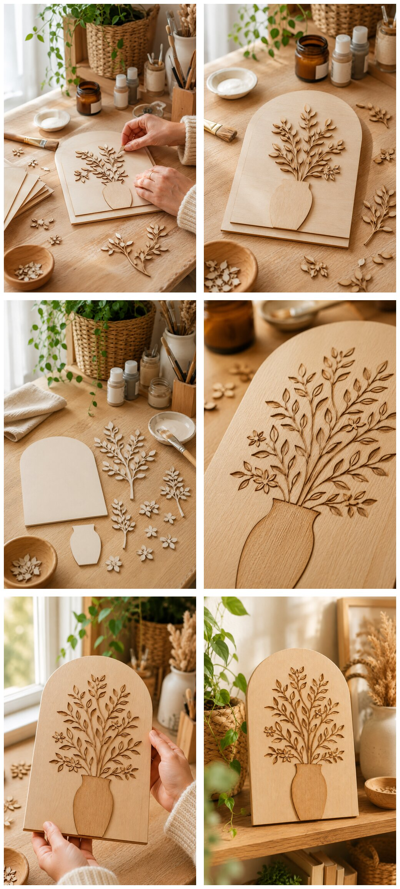

---

### Polaroid

Six Polaroid-style prints at random angles on a dark background — casual and nostalgic.

**Best images for this preset:**

- Events, vacations, candid moments, or behind-the-scenes shots
- Natural light, slightly imperfect framing, and candid subjects play into the aesthetic
- Clear subjects on relatively **clean or simple backgrounds** benefit most from the white Polaroid border
- Avoid polished product shots — the Polaroid effect suits personal, human, or spontaneous imagery

**[EXAMPLE OUTPUT: Polaroid 3×2 — random angles on dark background]**

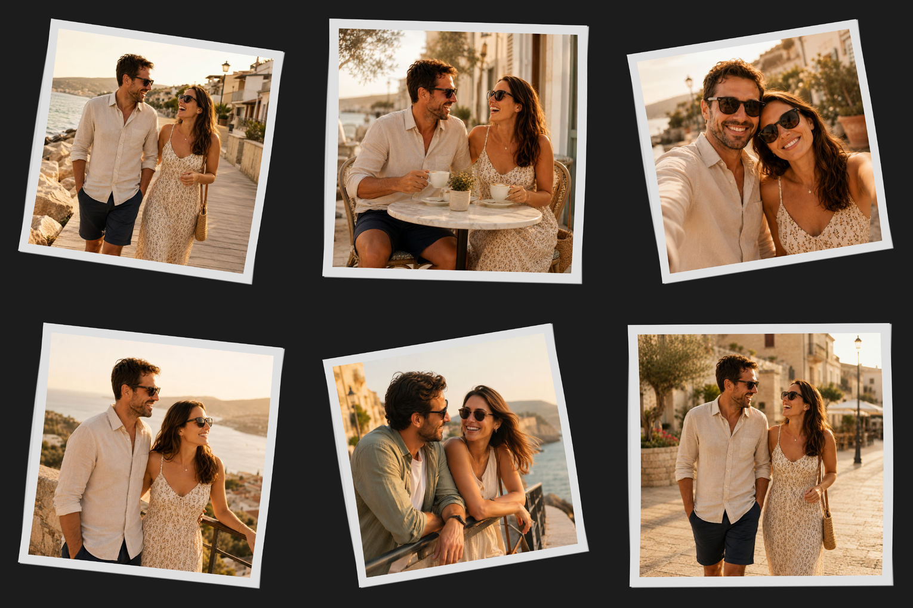

---

### Square 3×3

A clean 9-image grid at 720px tiles — the versatile general-purpose layout.

**Best images for this preset:**

- AI image batches, design variations, character studies, or any 9-image overview
- 9 images that benefit from **side-by-side comparison** — variations on a single theme
- Consistent style across all tiles; this is an overview grid, not a collage
- Ideal for exploring a subject space: same character in different styles, product in different colorways, lighting studies

**[EXAMPLE OUTPUT: Square 3×3 — 9-image overview grid]**


---

### X Post

A 2×2 grid cropped to 1200×675 — optimized for X (formerly Twitter) and Bluesky.

**Best images for this preset:**

- Announcements, project showcases, or punchy visual statements
- 4 **high-contrast** images with clear subjects — should grab attention mid-scroll
- Wide landscape format (16:9 per tile) — landscape or square images work best; portrait subjects get heavily center-cropped
- Bright colors or dramatic subject matter; avoid subtle gradients or muted palettes

**[EXAMPLE OUTPUT: X Post 2×2 — 1200×675 wide format]**

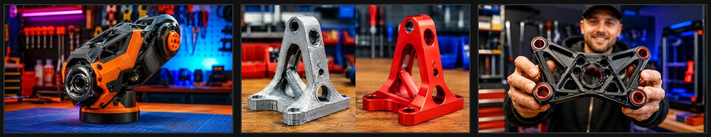

---

### YouTube Thumb

A 2×2 grid cropped to 1280×720 — YouTube thumbnail dimensions.

**Best images for this preset:**

- Content previews, video series overviews, or thumbnails for a video that covers multiple topics
- **Expressive faces and reactions** are the gold standard for YouTube thumbnails — they read at any size
- Bold, dramatic visual energy — slightly over-the-top performs better than understated
- Primary colors and sharp edges read well when shrunk; avoid subtle gradients or soft muted tones
- Test how it looks at 25% size — that's roughly how it appears in YouTube search results

**[EXAMPLE OUTPUT: YouTube Thumb 2×2 — 1280×720]**


---

## The Preset Manager

Click **Manage…** next to the Preset dropdown to open the Preset Manager.

From here you can:

- **Load** an existing preset into the form to review or edit it  
- **Save** under any name you like (spaces and proper case are fine; the only characters that aren't allowed are `]` and newlines)  
- **Delete** a preset you no longer need  
- **Clear** the form to start fresh from scratch

Presets are stored in `config.ini` in the same folder as the script, and are sorted alphabetically in the dropdown.

**[SCREENSHOT: Preset Manager dialog]** (Screenshot 12)

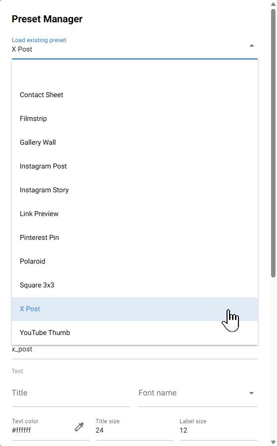

**Tip:** After dialing in a custom setup you like — say, your preferred tile size, a specific background color, and drop shadow on — save it as a preset with a memorable name. Future-you will be grateful.

---

## File Conflict Dialog

If files with your chosen prefix already exist in the output folder, a dialog pops up before anything is written. You have three choices:

| Option | What happens |
| :---- | :---- |
| **Cancel** | Nothing is written. You're back where you started. |
| **Auto-increment** | Appends `_v2`, `_v3`, etc. to create a new set alongside the existing files. |
| **Overwrite** | Replaces the **most recent version** only (e.g. if `_v3` files exist, only those are replaced — earlier versions are left alone). |

The dialog tells you exactly how many files are affected and which prefix Overwrite will target, so there are no surprises.

**Tip:** Auto-increment is the safe default if you're experimenting. Overwrite is handy when you're iterating on a final result and don't want to accumulate numbered versions.

---

## Using the CLI

Prefer the command line? The original CLI engine is still fully functional and lives in `montage_maker.py`.

```bash
python montage_maker.py [GRID] [OPTIONS]
```

### **Arguments**

| Argument | Default | Description |
| :---- | :---- | :---- |
| `GRID` | `2x2` | Grid layout, e.g. `3x4`. Optional if `--preset` is used. |
| `--preset NAME` | — | Load all settings from a named `config.ini` section |
| `--ext EXT` | `png` | Output file format |
| `--size WxH+HB+VB` | `500x500+10+10` | Tile size \+ horizontal/vertical spacing |
| `--label` | off | Turn filename labels on |
| `--fontsize N` | `12` | Label font size in points |
| `--prefix NAME` | `montage` | Output filename prefix |
| `--crop WxH` | — | Center-crop each image before tiling |

### **Examples**

***\# Simple 2×2 grid with default settings***  
python montage\_maker.py 2x2

***\# Use a saved preset***  
python montage\_maker.py \--preset "Instagram Post"

***\# Custom 2×2 with specific tile size, labels on, and larger font***  
python montage\_maker.py 2x2 \--size "500x500+5+5" \--label \--fontsize 24

**Note:** The CLI scans the **current working directory** for images, so `cd` into your image folder (or the folder containing them) before running. Output goes to the current directory as well. A `process.log` is written alongside the output files.

---

## Troubleshooting

**`montage: command not found`** ImageMagick isn't on your PATH. Reinstall it with "Add to PATH" checked during setup, then open a brand new terminal window.

**The app window fails to open (Windows)** The native window needs the Microsoft Edge WebView2 runtime. It comes pre-installed on Windows 10 and 11, but if it's missing, grab it from [developer.microsoft.com/microsoft-edge/webview2](https://developer.microsoft.com/microsoft-edge/webview2/).

**"Connection lost" toast appears during generation** This shouldn't happen in the current version (generation runs in a background thread). If it does appear, it means ImageMagick is taking an unusually long time with a large batch. Give it a moment — it should finish.

**Port conflict on startup** Click **Port: 8000** in the app header, enter a different port number that's not in use, save, and restart the app.

---

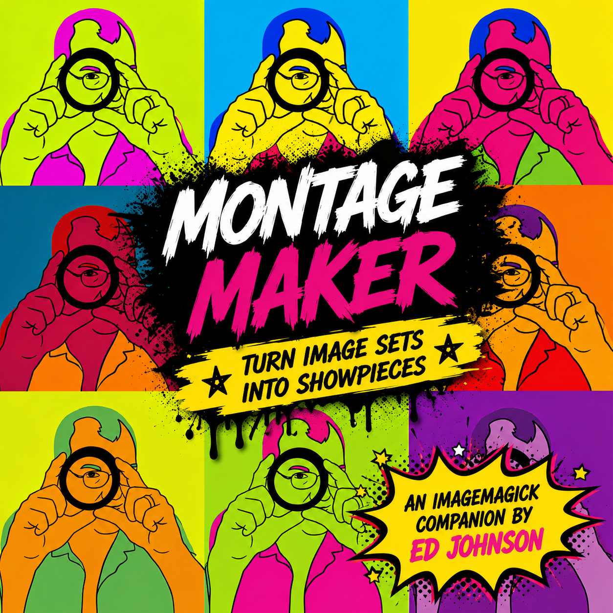

*Montage Maker is built with [NiceGUI](https://nicegui.io/) and [ImageMagick](https://imagemagick.org/).* 

*Montage Maker* source code is licensed separately from the project artwork, documentation, logo, and branding. See the README for full license details.

### **❤️ Support the Maker (and Lucy\!)**

I develop these tools to improve my own workflows and love sharing them with the community. If you find Montage Maker useful and want to say thanks, feel free to [**buy Lucy a dog treat on Ko-fi**](https://ko-fi.com/makingwithanedj)\!

---

*Happy Making\!* *— EdJ*
